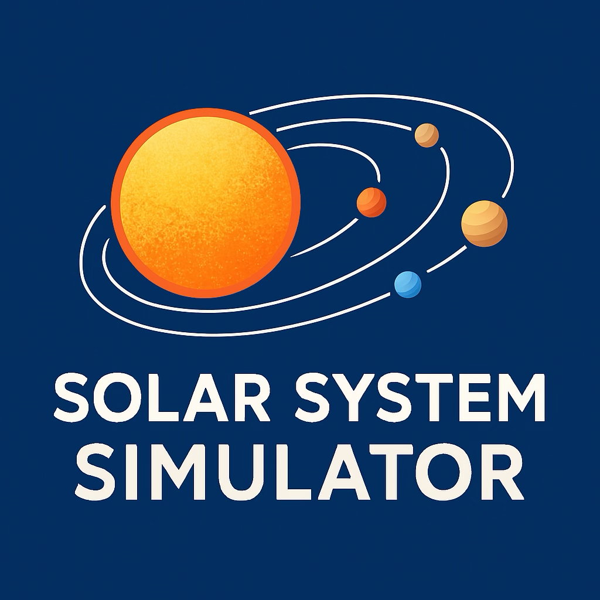

<p align="center">
  
</p>

<h1 align="center">Solar System Simulator</h1>

<p align="center">
  GPU-Accelerated, Physically Accurate &mdash; Go GUI + Rust Kernels
</p>

---

A cross-platform solar system & mission simulation toolkit with scientifically grounded physics, real-time visualization, and a modular architecture designed for incremental GPU acceleration.

## What's Working Today

- **Go GUI** (Fyne) — 3-panel layout with controls, simulation canvas, and live physics display
- **3D N-body physics** — 8 planets + Sun with full Keplerian orbital elements
- **RK4 integrator** — 4th-order Runge-Kutta with 2-hour timestep, stable for 100+ year simulations
- **General Relativity correction** — post-Newtonian perihelion precession for Mercury
- **Spacetime fabric visualization** — weak-field GR curvature overlay (toggleable)
- **Interactive controls** — play/pause, variable speed (1/1024x to 1024x), zoom, pan, 3D rotation, follow mode
- **Orbital trails** — adaptive resolution with alpha-fade
- **Distance measurement** — select two bodies to measure AU / km / light-minutes
- **Validation test suite** — 30 tests + 4 benchmarks covering Vec3 math, orbital mechanics, gravity, GR, energy/momentum conservation, golden baselines

## Project Structure

```
cmd/
  gui/main.go                  # GUI entry point
  cli/main.go                  # CLI stub (planned)
internal/
  math3d/                      # Vec3 type + operations
  physics/                     # Body, Simulator, RK4 integrator
    gr/                        # General Relativity correction
  render/                      # RenderCache + Renderer (Fyne canvas)
  spacetime/                   # Gravitational field visualization
  viewport/                    # Camera system (zoom, pan, 3D rotation)
  ui/                          # Fyne application + controls
pkg/
  constants/                   # G, AU, BaseTimeStep, C
```

## Quick Start

### Prerequisites

- Go 1.21+
- Git

#### macOS
```bash
xcode-select --install
```

#### Linux (Ubuntu/Debian)
```bash
sudo apt-get update
sudo apt-get install -y build-essential pkg-config libssl-dev \
  libx11-dev libxrandr-dev libxi-dev libxcursor-dev libxinerama-dev
```

### Build & Run

```bash
# Build and run
make run

# Or directly
go run ./cmd/gui

# Run tests
make test

# Run benchmarks
make bench
```

## Physics

### Orbital Mechanics
- Planets initialized from real Keplerian elements (a, e, i, &Omega;, &omega;, &nu;)
- Full 3D position/velocity conversion with Euler angle rotations
- Sun-only and N-body gravitational modes (toggleable)

### General Relativity
- Post-Newtonian correction: `a_GR = (3G²M²)/(c²r³L) · (L × r)`
- Applied to Mercury for perihelion precession (~43 arcseconds/century)
- Toggleable via UI checkbox

### Numerical Integration
- RK4 with simultaneous planet evaluation (snapshot-based)
- Thread-safe with `sync.RWMutex`
- Energy conservation drift < 1e-13 (Newtonian), < 1e-6 (N-body)
- Angular momentum conservation drift < 1e-15

### Validation Suite
| Test | What it verifies |
|------|-----------------|
| Vec3 operations | Add, Sub, Mul, Magnitude, Normalize, Dot, Cross |
| Orbital radius | r = a(1-e²)/(1+e·cos(ν)) for all planets |
| Gravity | Inverse-square law, N-body perturbations, symmetry |
| GR correction | Non-zero for Mercury, zero for others, formula match |
| Energy conservation | <1e-13 relative drift over 1000 steps |
| Angular momentum | <1e-15 relative drift over 1000 steps |
| Earth orbital period | 365.25 days ±1% |
| Golden baselines | Deterministic positions at step 100 and 1000 |

## Controls

| Control | Function |
|---------|----------|
| Play/Pause | Start/stop simulation |
| Speed slider | -10 to +10 (exponential: 2^x) |
| Rewind/Forward | Reverse or restore time direction |
| Zoom | 0.01x to 100x (log scale) |
| Auto-Fit | Zoom to fit all planets |
| Follow | Lock camera on Sun or any planet |
| 3D View | Enable pitch/yaw/roll rotation |
| Orbital Trails | Toggle trail rendering |
| Spacetime Fabric | Toggle GR curvature overlay |
| Planet Gravity | Toggle N-body interactions |
| General Relativity | Toggle Mercury GR correction |
| Sun Mass | Adjust 0.1x to 5.0x |

## Roadmap

### Completed

- [x] **Phase 0** — Test suite + golden baselines (30 tests, 4 benchmarks)
- [x] **Phase 1** — Refactor into modular Go packages (`cmd/`, `internal/`, `pkg/`)

### Planned

- [ ] **Phase 2** — Rust `physics_core` crate behind FFI
- [ ] **Phase 3** — Rust `render_core` (wgpu) for GPU-accelerated rendering
- [ ] **Phase 4** — Optional ray tracing mode (progressive)
- [ ] **Phase 5** — Asset pipeline (glTF models, 8K planet textures, sphere mesh generator)
- [ ] **Phase 6** — Kennedy Launch Planner + enhanced spacetime fabric visualization
- [ ] **Phase 7** — Packaging & installers (macOS `.dmg`, Windows `.msi`, Linux `.AppImage`/`.deb`)

### Future Features
- CLI/headless mode (`solar-sim run`, `solar-sim validate`, `solar-sim launch`)
- GPU auto-detection (AMD/NVIDIA/Apple Silicon → Metal/Vulkan/DX12 via wgpu)
- Symplectic integrator option for long-term stability
- Asteroid belt visualization with instancing + LOD
- PBR planet rendering with realistic textures
- Binary star systems and custom body configuration

## Accuracy Notes

This simulator is **physically grounded** — all calculations use SI units internally. Display scales are not to scale for readability; visualization uses scaled transforms. See `Physics Deep Dive.md` for full derivations and `Advanced.md` for extension ideas.

## Contributing

See `docs/CONTRIBUTING.md`.

## About

**Author:** Joshua Baney

Credits and references are listed in `docs/CREDITS.md`.

## License

MIT
